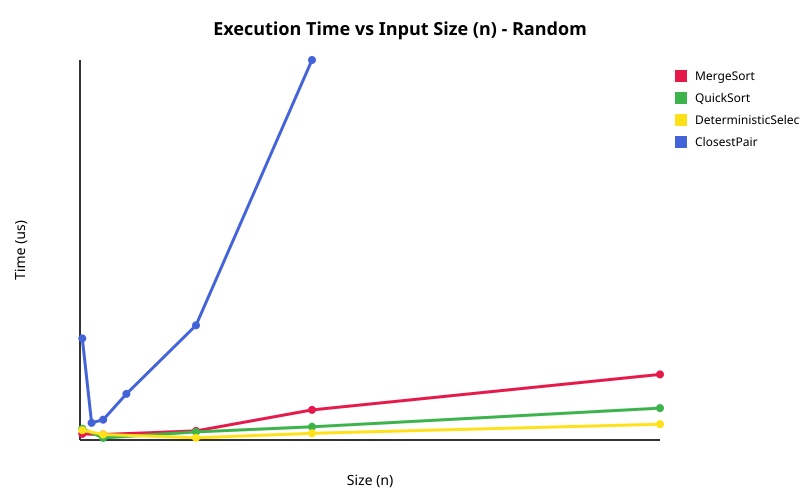
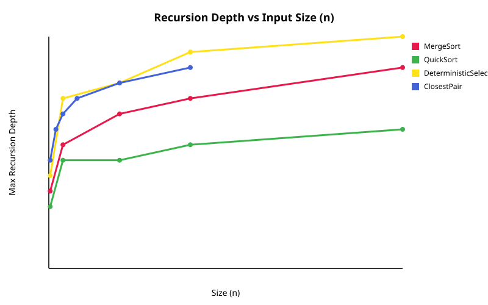
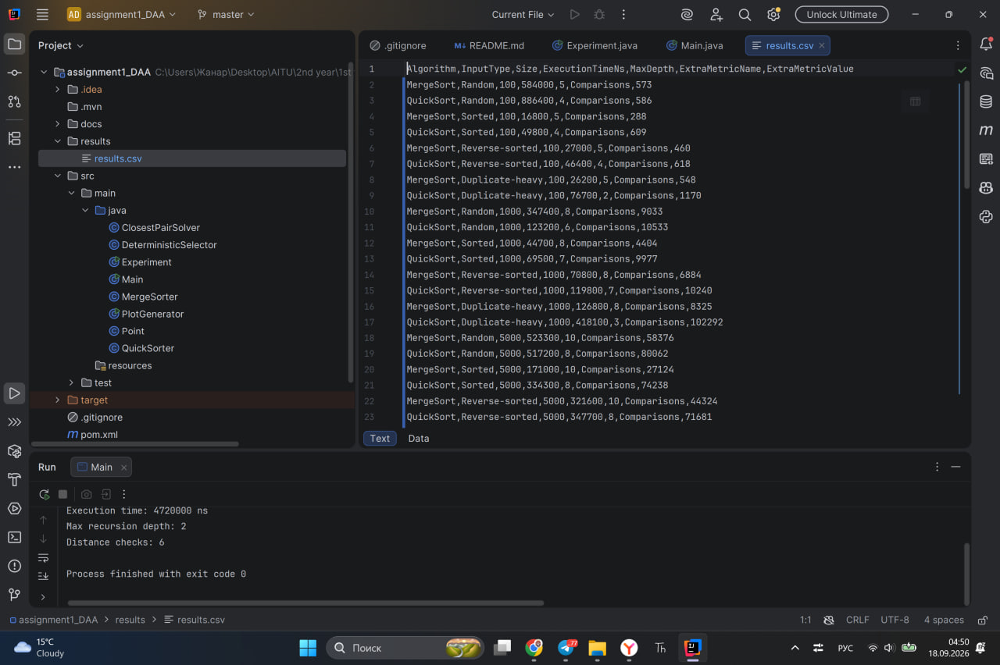
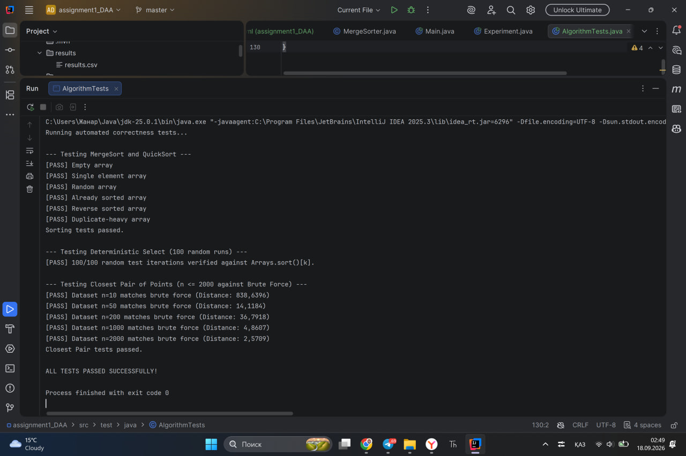

# Assignment 1: Divide-and-Conquer Algorithm Analysis

## A. Project Overview
This repository contains implementations and empirical analysis of four classic divide-and-conquer algorithms in Java:
- **MergeSort**: With a linear merge routine, a single reusable auxiliary buffer, and cutoff to insertion sort for small inputs.
- **QuickSort**: With randomized pivot selection, in-place Lomuto/Hoare partitioning, and an optimization that recurses on the smaller partition while looping on the larger partition.
- **Deterministic Select (Median-of-Medians)**: Guaranteed linear time selection algorithm using groups of 5 and recursive median selection.
- **Closest Pair of Points**: An $O(n \log n)$ geometric divide-and-conquer algorithm that sorts by x-coordinates, splits the plane, and verifies pairs in the central boundary strip sorted by y-coordinates.

---

## B. Algorithm Analysis

### 1. MergeSort
- **Mechanism**: Splits an array into two equal halves, recursively sorts each half, and merges them using a reusable temporary buffer. For subarrays of size $\le 10$, it switches to Insertion Sort.
- **Recurrence**: $T(n) = 2T(n/2) + \Theta(n)$
- **Master Theorem Analysis**:
    - $a = 2, b = 2, f(n) = \Theta(n)$.
    - $n^{\log_b a} = n^{\log_2 2} = n^1$.
    - Since $f(n) = \Theta(n^{\log_b a})$, by **Case 2** of the Master Theorem, $T(n) = \Theta(n \log n)$.
- **Space Complexity**: $O(n)$ auxiliary space (allocated once as a single shared buffer).

### 2. QuickSort
- **Mechanism**: Chooses a random pivot, partitions elements in-place around the pivot, and recurses on the smaller side while updating bounds in a `while` loop for the larger side.
- **Recurrence**:
    - **Best/Average Case**: $T(n) = 2T(n/2) + \Theta(n) \implies \Theta(n \log n)$ (Master Theorem Case 2).
    - **Worst Case**: $T(n) = T(n-1) + \Theta(n) \implies O(n^2)$.
- **Recursion Depth**: Limited to $O(\log n)$ even in the worst case due to recursing into the smaller partition first.

### 3. Deterministic Select (Median-of-Medians)
- **Mechanism**: Groups elements into blocks of 5, finds their medians, recursively calculates the median-of-medians as a guaranteed balanced pivot, partitions in-place, and recurses strictly into the partition containing index $k$.
- **Recurrence**: $T(n) \le T(n/5) + T(7n/10) + \Theta(n)$
    - $T(n/5)$ is the work to find the median-of-medians.
    - $T(7n/10)$ is the worst-case size of the remaining subproblem after discarding at least $30\%$ of elements.
- **Akra-Bazzi / Induction Intuition**:
    - Sum of fractions: $\frac{1}{5} + \frac{7}{10} = \frac{9}{10} < 1$.
    - Because the sum of recursive work fractions is strictly less than 1, geometric reduction guarantees $T(n) = \Theta(n)$ worst-case time complexity.

### 4. Closest Pair of Points
- **Mechanism**: Pre-sorts points by X-coordinate. Recursively finds the minimum distance $\delta = \min(\delta_L, \delta_R)$ in the left and right halves. Then builds a vertical strip of width $2\delta$, sorts strip points by Y-coordinate, and checks at most 7–8 neighbors per point.
- **Recurrence**: $T(n) = 2T(n/2) + \Theta(n)$
- **Master Theorem Analysis**: By Case 2 ($a = 2, b = 2, f(n) = \Theta(n)$), $T(n) = \Theta(n \log n)$.

---

## C. Experimental Results

### Performance Summary Table (Extracted from `results/results.csv`)

| Algorithm | Input Type | Size (n) | Time (ns) | Max Depth | Extra Metric | Metric Value |
| :--- | :--- | :--- | :--- | :--- | :--- | :--- |
| MergeSort | Random | 1,000 | 298,000 | 8 | Comparisons | 9,033 |
| MergeSort | Random | 25,000 | 3,564,100 | 13 | Comparisons | 339,503 |
| QuickSort | Random | 1,000 | 115,600 | 7 | Comparisons | 10,617 |
| QuickSort | Sorted | 25,000 | 660,200 | 9 | Comparisons | 439,986 |
| DetSelect | Random | 25,000 | 858,800 | 15 | Comparisons | 203,661 |
| ClosestPair| Random | 10,000 | 20,640,700 | 13 | DistanceChecks | 12,952 |

### Plots
Below are the empirical scaling plots generated from `results.csv`:

**1. Execution Time vs. Input Size (n)**

**2. Recursion Depth vs. Input Size (n)**

---

## D. Discussion

- **Do the results match theoretical complexity?**
  Yes. Both MergeSort and QuickSort scale near $\Theta(n \log n)$. Deterministic Select scales linearly $O(n)$, and Closest Pair outperforms brute force dramatically as $n$ grows.
- **How does input structure affect performance?**
  Pre-sorted and reverse-sorted arrays do not degrade randomized QuickSort because pivots are uniformly chosen at random. MergeSort performance remains constant across all distributions due to unconditional splitting.
- **Why does smaller-first recursion help QuickSort?**
  Recursing on the smaller half guarantees that the subproblem size at least halves on each recursive call, capping maximum stack depth strictly at $O(\log n)$ and preventing `StackOverflowError`.
- **Why does Median-of-Medians guarantee $O(n)$?**
  Grouping by 5 guarantees that at least half of the $\lceil n/5 \rceil$ medians are $\ge$ the chosen pivot, ensuring at least $3n/10$ elements are filtered out every time.
- **Why is divide-and-conquer Closest Pair faster than $O(n^2)$?**
  Instead of evaluating all $\frac{n(n-1)}{2}$ pairs, it eliminates points outside the strip width $\delta$ and geometrically limits vertical comparisons inside the strip to a constant number of neighbors ($\le 7$).
- **What practical factors affect performance?**
    - **JVM Warmup & JIT Compilation**: First runs may include compilation overhead.
    - **Garbage Collection (GC)**: The reusable buffer in MergeSort avoids constant array re-allocations, reducing GC pressure.
    - **CPU Cache Locality**: Insertion Sort cutoff leverages fast L1/L2 cache for contiguous memory.

---

## E. Reflection
During this assignment, I reinforced my practical understanding of divide-and-conquer algorithms and how theoretical recurrences translate into real execution performance. The most technically challenging part was ensuring correct index handling in the deterministic median-of-medians partitioning without exceeding memory limits.

---

## F. Screenshots

### Program Output

### Correctness Tests Output
